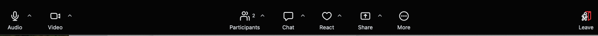
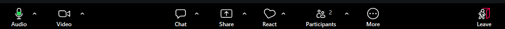

## Why online?

- [Proliferation of resources during the pandemic](https://docs.carpentries.org/resources/workshops/resources_for_online_workshops.html)
- We now serve three sites, 1 to 3 hours apart, plus each campus can be large
  - Research groups and offices on south, main, and north Norman campus too
- Disability and caregiver accessibility

## Ideas for preparation and organizing your space

- Second monitor, hypothes.is annotations
- Tablet (talk to LTP if you work at OU Libraries, in Norman can check out iPad from Bizzell circulation too)
- Paper versions (make sure your copy is up to date)

## Timing

- [Do not skip breaks!](https://carpentries.github.io/instructor-training/aio.html#prepare-to-cut)
- People's distance to break areas will vary wildly online
- Pausing after "what questions do you have?" needs to be longer, to allow folks to type or unmute
  - Count or time it, 10 to 20 seconds
- Better to cover less material, than more in a hurry (quality not quantity)

## Checking in with learners is a key part of Carpentries pedagogy in any format

- Always do [interaction (code-along) and conduct expectations, and roles introductions (who are helpers)](https://carpentries.org/blog/2022/03/online-teaching-kcl/)
- Ice breakers in 1 hour is usually too much time
- Check-ins are still key!

## Know your tools

- Understand Zoom
  - [Links to key documentation](https://docs.carpentries.org/resources/communications/zoom_rooms.html)
  - [Videos (a bit older but look useful)](https://teachremotely.harvard.edu/zoom-video-tutorials)
  - [Practice ahead of time](https://carpentries.github.io/instructor-training-bonus-modules/01-online-workshops-module-1.html)

## You can't rely on watching everyone's faces

- [Requiring screens on is fatiguing for many learners and can disproportionately affect some demographics](https://news.arizona.edu/news/turning-cameras-during-virtual-meetings-can-reduce-fatigue-uarizona-research-finds)
- [Impact varies by person](https://www-sciencedirect-com.ezproxy.lib.ou.edu/science/article/pii/S0959475225001227?via%3Dihub), so let learners decide for themselves

## You still need to have your video on, if at all possible

- Lip reading
- Stop video if
  - Internet is unstable for you
  - [Many learners mention slow connections](https://carpentries.org/blog/2022/03/online-teaching-kcl/)

## Communicating with the learners

- Etherpad (beware monitoring two chats)
- Zoom chat, polls
- Hand raise - sticky notes!!

## Sticky notes = "raise hand"

{fig-alt="Zoom bar on Mac, showing buttons, from left to right: audio, video, participants, chat, react (a heart outline), share, more, and leave"}

{fig-alt="Zoom bar on Windows, showing buttons, from left to right, audio, video, share, react (a heart outline that is slightly tilted to the right), participants, more, and leave"}

- React is a heart icon
  - This button disappears when you share your screen, so you will not be able to see it while you are presenting
- Ask learners to use the "raise hand" reaction as it stays in place, unlike the emoji reactions.
- Compactly viewed via "Participants" panel (versus gallery of faces)

## Big check-ins

- Continue to use [general](https://carpentries.org/blog/2020/03/tips-for-teaching-online/) "What questions do you have?" and "can I clarify anything or re-explain something?" with longer pauses

## Frequent small check-ins
- Ask defined questions that can be answered in chat or with raised hands (yes or no)
  - [Less informative](https://carpentries.github.io/instructor-training/aio.html#how-frequent)
    - "Does that make sense?"
    - "Do you understand?"
  - More informative
    - "Paste code to answer this challenge" (chat)
    - "Raise your hand when you've completed the highlighted code" (sticky analogs)
    - "Paste your error and code into the chat if it doesn't work for you"
- Suggestion: Ask more often than in person, because it's harder to catch people up individually

## Avoid breakout rooms unless you're having a discussion

- Ensure you have at least one helper who can troubleshoot via chat (Carpentries ratio of helpers to learners)
- Ask permission before having someone with difficulties share their screen
  - Still do not take over, give verbal instructions on where to click, type, etc
- Thank them for helping and re-iterate how everyone has similar problems in every workshop (["encourage a growth mindset"](https://carpentries.github.io/instructor-training/11-practice-teaching.html))
- [Tips for breakout room discussions from CMU](https://www.cmu.edu/canvas/teachingonline/zoom/zoompedagogy.html)
  - The biggest point is have a specific task or goal!

## Practice being co-host

- Lower hands ("clear all feedback" only available to hosts and co-hosts)
- Find the "invite to share screen" option which is sometimes available

## Common problems

[Listed in "Interacting with your learners"](https://carpentries.github.io/instructor-training-bonus-modules/01-online-workshops-module-1.html#interacting-with-your-learners-online-40-min)

- Etherpad versus zoom chat
- Overly active chat (in big workshops)
- Hesitation to interrupt by learners

## Summary

- Even more frequent check-ins, use hand raise
- Have a separate screen or notes
- Have a helper if you have more than half a dozen people

## We're doing this for the learners

- [Teaching is a skill](https://carpentries.github.io/instructor-training/11-practice-teaching.html)
- Online teaching is a skill you can improve too

